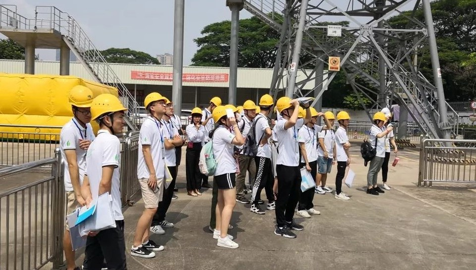

<!--

                                                                                                                                                                    
-->

<!--
<a class="toc_title" style="font-size: 15px;" id="toc"> <b>TOC of This Page</b> </a>
-->
  <ul class="toc_list">
    <li><a href="#Academic Activity">Academic Activity</a></li>
    <li><a href="#Internship">Internship</a></li>
    <li><a href="#Leadership">Leadership</a></li>
    <li><a href="#Awards and Honors">Awards and Honors</a></li>
  </ul>

<h3 class="h2" style="color: rgb(1,92,171)" id="Academic Activity">Academic Activity</h3>

   <strong>Academic Journals</strong> 
   <a style="margin-right: 2em;color: black;"> Peer Reviewer</a>   <a style="margin-right: 2em;color: black;"> Oct. 2020 - Present</a> 

 <ul>
    <li> Reviewed 2 manuscripts submitted to IEEE Transactions on Industry Applications </li>
    <li> Reviewed 25 manuscripts submitted to IEEE ACCESS </li>
    <li> Assisted the advisor in reviewing several journals </li>
    <li> The related recording can be found at  <a href="https://www.webofscience.com/wos/author/record/1963852" title="Peer Review Record" target="_blank" alt="Clarivate">   Web of Science </a> </li>
  </ul>

<!--  <a href="/publications/2021IES">Reading details</a>
-->

 

  <strong>International Conferences</strong> 
  <a style="margin-right: 2em;color: black;"> Presentation / Attendance </a>   <a style="margin-right: 2em;color: black;"> Oct. 2019 - Present </a> 

   <ul>
    <li> <a href="http://www.cieec-conf.org/" target="_blank">IEEE 5th International Electrical and Energy Conference (CIEEC 2022)</a>, Nanjing, May. 2022 </li>
    <li> <a href="https://attend.ieee.org/ei2-2021/" target="_blank">The 5th IEEE Conference on Energy Internet and Energy System Integration (EI2 2021)</a>, Taiyuan, Oct. 2021 </li>
    <li> <a href="https://mp.weixin.qq.com/s/UW4-CaXctjMPGjMizglilw" target="_blank">2021 Joint Annual Conference of the Power System Committee-New Energy Committee of the Chinese Society of Electrical Engineering</a>, Nanjing, May. 2021 </li>
    <li> <a href="http://2020.meeting-sgee.org/" target="_blank">International Conference on Smart Grid and Energy Engineering (SGEE 2020)</a>, Guilin, Nov. 2020 </li>
    <li> <a href="http://www.csee.org.cn/" target="_blank">2019 Annual Meeting of Chinese Society for Electrical Engineering (CSEE Annual 2019)</a>, Beijing, Nov. 2019 </li>
  </ul>

<!--  <a href="/publications/2021IES">Reading details</a>
-->
  

  
  

 

<h3 class="h2" style="color: rgb(1,92,171)" id="Internship">Internship</h3>

   <strong>Frontiers Journals, <a href="https://www.hep.com.cn/" target="_blank">Higher Education Press</a></strong> 
   <a style="margin-right: 2em;color: black;"> Publicist</a>   <a style="margin-right: 2em;color: black;"> May. 2022 - Aug. 2022</a> 

 <ul>
    <li> Promoted the public acknowledgment of <a href="https://journal.hep.com.cn/hep/EN/hep/home.shtml" target="_blank"> <i>"Frontiers Journals"</i></a>, an English academic journal series launched by Higher Education Press (HEP), through posters, online forums, and meetings with scholars </li>
  </ul>

  

<!--  <a href="/publications/2021IES">Reading details</a>
-->

 

  <strong>Yangzhou Electric Power Co., Ltd, <a href="http://www.sgcc.com.cn/ywlm/index.shtml" target="_blank">State Grid</a></strong> 
  <a style="margin-right: 2em;color: black;"> Intern </a>   <a style="margin-right: 2em;color: black;"> Jul. 2021 - Jan. 2022 </a> 

   <ul>
    <li> Investigated the power overcapacity problems of typical users (e.g., Tea factory, Fish breeding pond) </li>
    <li> Compare the pros and cons of multiple schemes such as capacity increase, overcapacity fines, and shared energy storage</li> 
    <li> Proposed the suitable and economical method to solve the above-mentioned issues by optimizing spatiotemporal scheduling of shared energy storage</li>
  </ul>
  
  

  <source src="./Yangzhou.mp4" type="video/mp4">

<!--  <a href="/publications/2021IES">Reading details</a>
-->

  

   

  <strong>Huizhou Electric Power Co., Ltd, <a href="https://en.wikipedia.org/wiki/China_Southern_Power_Grid" target="_blank">China Southern Power Grid</a></strong> 
  <a style="margin-right: 2em;color: black;"> Intern </a>   <a style="margin-right: 2em;color: black;"> Jul. 2019 - Aug. 2019 </a> 

   <ul>
    <li> Experienced the workflow of dispatch centers, transformer substations and other departments on the spot </li>
    <li> Participated in safety training and electrical safety physical perception test </li>
    <li> Strengthened  cooperation and publicity between NCEPU and Guangdong Electric Power Co., Ltd</li>
  </ul>
  
  

<!--  <a href="/publications/2021IES">Reading details</a>
-->
  
  

<h3 class="h2" style="color: rgb(1,92,171)" id="Leadership">Leadership</h3>

   <strong>School of Electrical and Electronic Engineering, North China Electric Power University</strong> 
   <a style="margin-right: 2em;color: black;"> Student Leader</a>   <a style="margin-right: 2em;color: black;"> Sept. 2016 - Jun. 2020</a> 

 <ul>
    <li> Received and dispatched messages/materials, and allocated tasks detailedly </li>
    <li> Assisted teachers in daily management in order to better serve students </li>
  </ul>

<!--  <a href="/publications/2021IES">Reading details</a>
-->

 

  <strong>Student Committee, North China Electric Power University</strong> 
  <a style="margin-right: 2em;color: black;"> Member of Student Committee </a>   <a style="margin-right: 2em;color: black;"> Feb. 2016 - Jun. 2019 </a> 

   <ul>
    <li> Held responsible for elections, proposals, candidate reviews, and the annual Congress </li>
    <li> Served for 3 terms as a Member of Student Committee</li> 
  </ul>
  

<!--  <a href="/publications/2021IES">Reading details</a>
-->

  

<h3 class="h2" style="color: rgb(1,92,171)" id="Awards and Honors">Awards and Honors</h3>

<table>
  <tbody>
    <tr>
      <td>Oct. 2022</td>
      <td>Graduate Scholarship of SEU</td>
      <td>Southeast University, Nanjing</td>
    </tr>
    <tr>
      <td>Nov. 2021</td>
      <td>Graduate Scholarship of NR Electric Co., Ltd</td>
      <td><a href="http://www.narigroup.com/NR" target="_blank"> NR Electric Co., Ltd</a>, Nanjing</td>
    </tr>
    <tr>
      <td>Oct. 2021</td>
      <td>Graduate Scholarship of SEU</td>
      <td>Southeast University, Nanjing</td>
    </tr>
    <tr>
      <td>Nov. 2020</td>
      <td>Second Prize of China in "<a href="https://cpipc.acge.org.cn/cw/hp/4" target="_blank"> National Post-Graduate Mathematical Contest in Modeling</a>" </td>
      <td>Ministry of Education & East China University of Science and Technology, Shanghai</td>
    </tr>
    <tr>
      <td>Oct. 2020</td>
      <td>Graduate Scholarship of SEU</td>
      <td>Southeast University, Nanjing</td>
    </tr>
    <tr>
      <td>Jun. 2020 </td>
      <td>"Excellent Graduate of Beijing" Honorary Title (Top 5%)</td>
      <td><a href="http://jw.beijing.gov.cn/" target="_blank"> Beijing Municipal Education Commission</a>, Beijing</td>
    </tr>
    <tr>
      <td>Nov. 2019 </td>
      <td>First Prize of Beijing in "<a href="http://www.mcm.edu.cn/" target="_blank"> Contemporary Undergraduate Mathematical Contest in Modeling</a>"</td>
      <td><a href="http://jw.beijing.gov.cn/" target="_blank"> Beijing Municipal Education Commission</a>, Beijing</td>
    </tr>
     <tr>
      <td>Oct. 2019 </td>
      <td>Undergraduate Scholarship of NCEPU</td>
      <td>North China Electric Power University, Beijing</td>
    </tr>
    <tr>
      <td>Sept. 2019 </td>
      <td>Student of Merit of NCEPU</td>
      <td>North China Electric Power University, Beijing</td>
    </tr>
    <tr>
      <td>May. 2019 </td>
      <td>"National Excellent" Degree in "National College Student Innovation and Entrepreneurship Training Program"</td>
      <td>Ministry of Education, Beijing</td>
    </tr>
       <tr>
      <td>Oct. 2018 </td>
      <td>Undergraduate Scholarship of NCEPU</td>
      <td>North China Electric Power University, Beijing</td>
    </tr>
       <tr>
      <td>Oct. 2018 </td>
      <td>Scholarship of CPCEP Co., Ltd</td>
      <td><a href="http://www.cpcepgroup.com/index.php?siteid=2" target="_blank"> CPCEP Co., Ltd</a>, Beijing</td>
    </tr>
    <tr>
      <td>Sept. 2018 </td>
      <td>Outstanding Student Leaders (One recipient per school)</td>
      <td>North China Electric Power University, Beijing</td>
    </tr>
       <tr>
      <td>Oct. 2017 </td>
      <td>Undergraduate Scholarship of NCEPU</td>
      <td>North China Electric Power University, Beijing</td>
    </tr>
       <tr>
      <td>Oct. 2017 </td>
      <td>Scholarship of Beijing Banner Electric Co., Ltd</td>
      <td><a href="http://www.bjbanner.com/" target="_blank">Beijing Banner Electric Co., Ltd</a>, Beijing</td>
    </tr>
    <tr>
      <td>Sept. 2017 </td>
      <td>Outstanding Student Leaders (One recipient per school)</td>
      <td>North China Electric Power University, Beijing</td>
    </tr>
  </tbody>
  <colgroup>
    <col>
    <col>
    <col>
  </colgroup>
</table>

<!-- 

Innovation starts here. We’ll design—or transform—your business, revenue, and pricing models for product/market fit, competitive strength, and durability against the future. We’ll uncover and address hidden assumptions, blind spots, and risks, and then put your models into play.

Here you should be able to find everything you need to know to accomplish the most common tasks when blogging with Hydejack.
Should you think something is missing, [please let me know](mailto:mail@qwtel.com).
Should you discover a mistake in the docs (or a bug in general) feel free to [open an issue](https://github.com/hydecorp/hydejack/issues) on GitHub.

While this manual tries to be beginner-friendly, as a user of Jekyll it is assumed that you are comfortable running shell commands and editing text files.
{:.note}

  -->