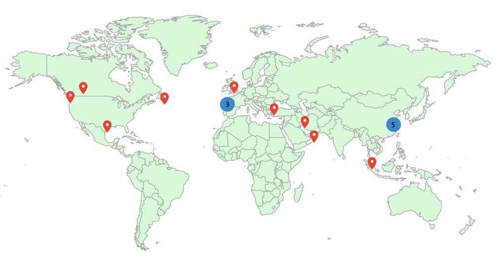

<!--
<a class="toc_title" style="font-size: 15px;" id="toc"> <b>TOC of This Page</b> </a>
-->
  <ul class="toc_list">
    <li><a href="#Journal Papers">Journal Papers</a></li>
    <li><a href="#Conference Papers">Conference Papers</a></li>
    <li><a href="#Patents">Patents</a></li>
    <li><a href="#Thesis">Thesis</a></li>
    <li><a href="#Citation Map">Citation Map</a></li>
  </ul>

<h3 class="h2" style="color: rgb(1,92,171)" id="Journal Papers">Journal Papers</h3>

<ol ><li>

  

    <b>J. Yin</b>, J. Wang, J. You, H. Chen, and W. Shi. "Integrated Energy System Optimal Operation in Coal District With Hydrogen Heavy Trucks,"
   <i>Frontiers in Energy Research,</i> vol. 9, pp. 607-621, 2021.   
   [<a href="/assets/files/2020FER-Integrated Energy System Optimal Operation in Coal District With Hydrogen Heavy Trucks.pdf" target="_blank">  PDF</a>] &nbsp;
   [<a href="https://www.frontiersin.org/articles/10.3389/fenrg.2021.748673/full" target="_blank">Frontiers Website</a>] &nbsp;
    <a href="/publications/2021IES">Reading details</a>
  

</li>

<!--<li>
 

   <b>J. Yin</b>, Y. Chen, G. Sang, B. Liao and X. Wang, "QoE-Oriented Rate Control and Resource Allocation for Cognitive M2M Communication in Spectrum-Sharing OFDM Networks," 
    <i>IEEE Access</i>, vol. 7, pp. 43318-43330, 2019.  
   [<a href="/assets/files/2019ACCESS-QoE-Oriented Rate Control and Resource Allocation for Cognitive M2M Communication in Spectrum-Sharing OFDM Networks.pdf" target="_blank">  PDF</a>] &nbsp;
   [<a href="https://ieeexplore.ieee.org/document/8678771" target="_blank">  IEEE Xplore Website</a>] &nbsp;
   <a href="/publications/2019M2M">Reading details</a>
  

</li>
-->

<li>
 

    B. Kong, J. Zhu, S. Wang, X. Xu, X. Jin, <b>J. Yin</b>, J. Wang. "Comparative Study of the Transmission Capacity of Grid Forming Converters and Grid Following Converters," <i>Energy Reports</i>, 2022. (Accepted on Oct. 2022)
  

</li>

<li>
 

    W. Xu, W. Zhang, Y. Hu, <b>J. Yin</b> and J. Wang, "Multi Energy Flow Optimal Scheduling Model of Advanced Adiabatic Compressed Air Energy Storage," 
    <i>Transactions of China Electrotechnical Society</i>, vol. 37, no. 23, pp. 5944-5955, 2022. (In Chinese) 

    徐卫君, 张伟, 胡宇涛, <b>尹俊杰</b>, 王建华. 先进绝热压缩空气储能多能流优化调度模型[J]. 电工技术学报, 2022, 37(23):5944-5955. 
   [<a href="/assets/files/2022Compressed Air.pdf" target="_blank">  PDF</a>] &nbsp;
   [<a href="https://kns.cnki.net/kcms/detail/detail.aspx?doi=10.19595/j.cnki.1000-6753.tces.220772" target="_blank">  CNKI Website</a>]&nbsp;
   [<a href="https://mp.weixin.qq.com/s/alND9Crx-8ABDW1FMADdgQ" target="_blank">  Journal official reports (期刊官方报道)   </a>]
  

</li>

<li>
 

    H. Lu, Z. Zhuang, L. Chen, W. Zhang, <b>J. Yin</b> and J. Wang, "Optimal Scheduling of Multi-energy Flow of CCHP Based on Matrix Modeling of Energy Hub," 
    <i>Machine Building & Automation</i>, vol. 5, pp. 228-234, 2022. (In Chinese)  

   陆怀谷, 庄重, 陈亮, 张伟, <b>尹俊杰</b>, 王建华. 基于能源集线器矩阵化建模的冷热电多能流优化调度[J]. 机械制造与自动化, 2022, 51(05):228-234. 
   [<a href="/assets/files/2022Enegy hub.pdf" target="_blank">  PDF</a>] &nbsp;
   [<a href="https://kns.cnki.net/kcms/detail/detail.aspx?doi=10.19344/j.cnki.issn1671-5276.2022.05.055" target="_blank">  CNKI Website</a>]
  

</li>

<li>
 

    J. Wang, <b>J. Yin</b>, X. Jin. "Improved Reactive Loop-Based Sequence Impedance Model and Stability Analysis of VSG Inverters with Coupling Frequency," <i>IEEE Transactions on Power Electronics</i>, 2022. (Submitted)
  

</li>

<li>
 

    S. Li, J. Wang, <b>J. Yin</b>, et al. "Impedance Modeling and Additional Current Feedback Control of DC Transformer Based on Switched Capacitor,” <i>IEEE Transactions on Power Delivery</i>, 2022. (Submitted)
  

</li>

<li>
 

    X. Jin, J. Wang, G. Lou, <b>J. Yin</b>, Y. Hu. "Series Optimization Design of Advanced Adiabatic Compressed Air Energy Storage Power System Based on Thermodynamic Analysis,” <i>Proceedings of the CSEE</i>, 2022. (In Chinese, Submitted)
  

</li>

</ol>

---

<h3 class="h2" style="color: rgb(1,92,171)" id="Conference Papers">Conference Papers</h3>

<ol>

<li>

    

    W. Zhang, W. Xu,  Y. Hu, <b>J. Yin</b>. "Multi Energy Flow Optimal Scheduling Model of Compressed Air Energy Storage Based on Matrix Modeling of Energy Hub,"
   <i>Proceedings of 2022 The 4th International Conference on Power and Energy Technology</i>, pp. 789-794, Xining, China, Jul. 2022. 
   [<a href="/assets/files/2022ICPET.pdf" target="_blank">  PDF</a>] &nbsp;
   [Oral Presenter] &nbsp;
   [<a href="https://ieeexplore.ieee.org/document/9918430" target="_blank">Link</a>] &nbsp;
   <!--<a href="/publications/ICPET2022">Reading details</a> -->
  

</li>

<li>

  

    S. Jiang, Y. Wang, D. Wang, <b>J. Yin*</b>, H. Yan and J. Wang. "Reliability Assessment of Distribution Network Considering Differentiated End-Users Demand for Reliability,"
   <i>Proceedings of  2020 International Conference on Smart Grid and Energy Engineering</i>, pp. 012026-012032, Guilin, China, Nov. 2020. 
   [<a href="/assets/files/2020SGEE.pdf" target="_blank">  PDF</a>] &nbsp;
   [<a href="/assets/files/2020SGEE_poster.pdf" target="_blank"> Poster</a>] &nbsp;
   [<a href="https://iopscience.iop.org/article/10.1088/1755-1315/645/1/012026" target="_blank">Link</a>] &nbsp;
   <!--  <a href="/publications/SGEE2020">Reading details</a>  -->
  

</li>

</ol>

---

<h3 class="h2" style="color: rgb(1,92,171)" id="Patents">Patents</h3>

<ol >
  <li>

<b>J. Yin</b>, J. Wang, N. Wang, et al. "A User-Oriented Calculation Method of Distribution Network Reliability Evaluation Index." China Patent No. 2022108630263.  Jul. 2022.

</li>

  <li>

J. Wang, <b>J. Yin</b>, H. Yan. "Method for Weight Formulating of the Evaluation Index of Distribution Network Reliability." China Patent No. 2022100109403.  Jan. 2022.

</li>

  <li>

J. Wang, <b>J. Yin</b>, X. Li. "A Modeling Method of Converter Sequence Impedance in Rectifier-Inverter Mode." China Patent No. 2021112230502. 20 Oct. 2021.

</li>

  <li>

J. Wang, <b>J. Yin</b>, X. Li. "An Improved Control Method for Power Decoupling Based on Adaptive Virtual Impedance." China Patent No. 2021112230517. Oct. 2021.

</li>
</ol>

---

<h3 class="h2" style="color: rgb(1,92,171)" id="Thesis">Thesis</h3>

<ol ><li>

  

    <b>J. Yin</b>. "Research on Transient Stability of Grid-connected Converter," <b>Master Thesis</b>, Southeast University, Nanjing, June 2023. (To be expected) 
    Advisor: <a href="https://ee.seu.edu.cn/2021/0308/c25248a362833/page.htm" title="Prof. Wang in SEU" target="_blank">Prof. Jianhua Wang</a>  
  

</li>
<li>
  
   

    <b>J. Yin</b>. "Research on Multi-energy Flow Interactive Coupling Characteristics and Optimal Scheduling of Integrated Energy System," <b>Bachelor Thesis</b>, North China Electrical Power University, Beijing, June 2020. 
    Advisor: <a href="https://ieeexplore.ieee.org/author/37089503434" title="Prof. Zeng in NCEPU" target="_blank">Prof. Bo Zeng</a>
  

</li></ol>

---

<h3 class="h2" style="color: rgb(1,92,171)" id="Citation Map">Citation Map</h3> 

{:.lead width="100%" loading="lazy"}
